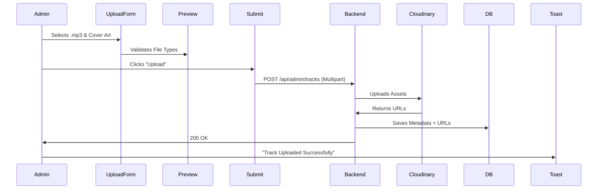

# StreamLite - Admin CMS Portal 🛡️

The **StreamLite Admin Portal** is the Content Management System (CMS) and control tower for the entire platform. Designed for operational security and efficiency, it runs as a completely independent application from the user frontend.

> **Status:** 🟢 Active | **Type:** Internal Tool | **Served on:** `localhost:5174`

---

## 📑 Table of Contents
1.  [CMS Architecture](#-cms-architecture)
2.  [Feature Deep Dive](#-feature-deep-dive)
3.  [Security & Auth](#-security--auth)
4.  [Technology Stack](#-technology-stack)
5.  [Setup & Usage](#-setup--usage)

---

## 🏗 CMS Architecture

The Admin Portal is a "Thick Client" dashboard. It performs heavy lifting in terms of file processing (multipart forms) before sending data to the backend storage services.

### Workflow: Adding a Song


---

## 🔍 Feature Deep Dive

### 1. Dashboard Analytics
The entry point (`adminDashboard.jsx`) aggregates vital health metrics:
*   **Total Songs/Podcasts:** Live count from database.
*   **User Base:** Active user count.
*   **Visuals:** Uses Lucide Icons for clean, professional data visualization.

### 2. Media Upload Studio
We provide specialized forms for different media types:
*   **`UploadTrack.jsx`**: For single music files. Includes genre categorization.
*   **`UploadPodcast.jsx`**: Creates a Podcast "Series" container.
*   **`UploadEpisode.jsx`**: Adds episodes to existing series. Matches ID via dropdown.

### 3. User Management
A tabular view (`AdminUsers.jsx`) to oversee the community.
*   **Data:** Name, Email, Registration Date.
*   **Actions:** (Future Roadmap) Ban/Suspend users directly from UI.

---

## 🔐 Security & Auth

Security is paramount for the admin panel.

### The `PrivateRoutes` HOC
We utilize a Higher-Order Component pattern for route protection.

*   **Logic:**
    1.  Check `localStorage` for `token`.
    2.  If token exists -> Render Child Component (The Dashboard).
    3.  If token missing -> **Redirect** immediately to `/admin/login`.

### Admin Scope
The backend enforces `role: 'admin'` checks on all API endpoints triggered by this app. Even if a user steals a token, they cannot perform admin actions without the correct role claim in the JWT.

---

## 💻 Technology Stack

This app diverges slightly from the frontend stack to prioritize utility and stability.

| Tool | Context |
| :--- | :--- |
| **Vite** | Build Tool. |
| **React** | Framework. |
| **Tailwind CSS v4** | (Via `@tailwindcss/postcss`) Latest styling engine. |
| **React Toastify** | Critical for CMS feedback (e.g., "Upload Failed: File too large"). |
| **Lucide React** | Consistent Admin UI iconography. |

---

## 🛠 Setup & Usage

### 1. Installation
The admin app is a separate Node project.
```bash
cd admin
npm install
# Note: Ensure @tailwindcss/postcss is installed if using v4 features
npm install -D @tailwindcss/postcss
```

### 2. Running the Portal
```bash
npm run dev
```
*   **Port:** Default is `5173`, but if Frontend is running, Vite auto-switches to `5174`.
*   **URL:** `http://localhost:5174/admin/login`

### 3. Default Credentials
(Stored in your Database)
*   **Email:** `admin@streamlite.com`
*   **Password:** (As configured in seed script)

---

## 📝 Contribution Guide
*   **New Pages:** Add to `pages/` directory and register in `App.jsx` inside `<PrivateRoutes>`.
*   **Styling:** Adhere to the "Dark Mode" aesthetic defined in `index.css`.
